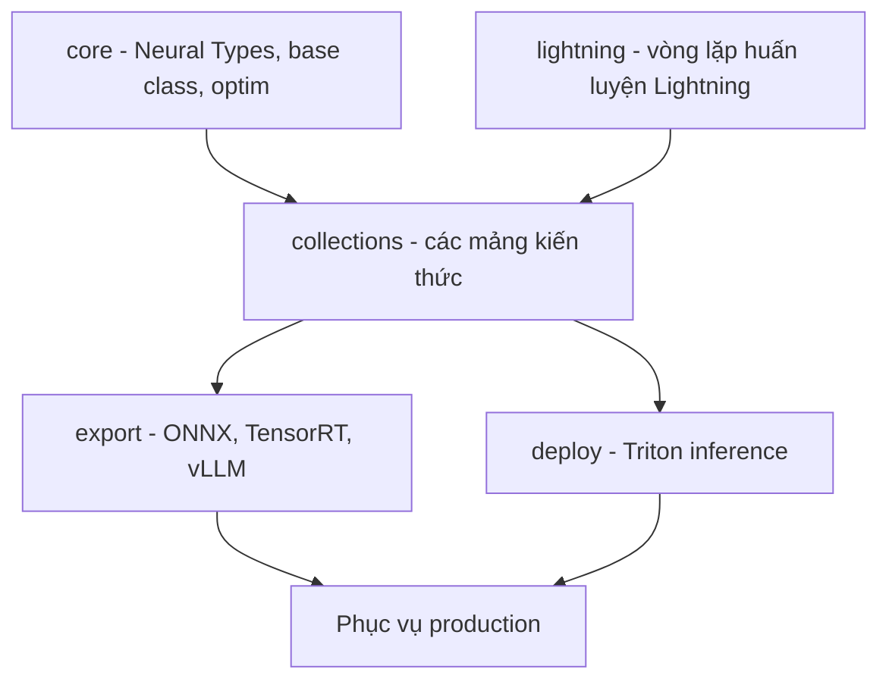
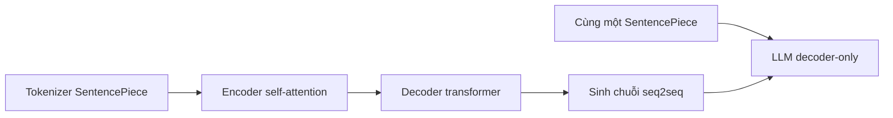

# 00 — Bản đồ tổng quan: ôn tập NLP qua NeMo

Tài liệu tổng quan, định vị các mảng kiến thức và neo từng mảng vào mã nguồn NeMo thật.
Nội dung lý thuyết khách quan nằm ở Mục 1–7; lộ trình triển khai và đề xuất hành động tách riêng ở Mục 8.

---

## Glossary — ký hiệu viết tắt

- **NeMo** — Neural Modules: toolkit của NVIDIA, ráp mô hình từ các khối có input/output gắn kiểu (typed).
- **ASR** — Automatic Speech Recognition: nhận dạng tiếng nói thành văn bản.
- **NLP** — Natural Language Processing: xử lý ngôn ngữ tự nhiên.
- **LLM** — Large Language Model: mô hình ngôn ngữ lớn (thường ≥ 1B tham số).
- **CTC** — Connectionist Temporal Classification: hàm mất mát/giải mã căn chuỗi không cần nhãn căn theo khung thời gian.
- **RNNT** — RNN Transducer: kiến trúc giải mã có encoder + prediction network + joint network, phù hợp streaming.
- **AED** — Attention-based Encoder–Decoder: kiến trúc encoder–decoder dùng attention (ví dụ mô hình Canary).
- **SSL** — Self-Supervised Learning: học tự giám sát, tiền huấn luyện không cần nhãn.
- **BERT** — Bidirectional Encoder Representations from Transformers: mô hình encoder hai chiều.
- **NER** — Named Entity Recognition: nhận dạng thực thể có tên.
- **NMT** — Neural Machine Translation: dịch máy bằng mạng nơ-ron.
- **QA** — Question Answering: hỏi đáp.
- **RAG** — Retrieval-Augmented Generation: sinh có truy hồi tri thức.
- **PEFT** — Parameter-Efficient Fine-Tuning: tinh chỉnh tiết kiệm tham số.
- **LoRA / DoRA** — hai phương pháp PEFT phổ biến.
- **KWS** — Keyword Spotting: phát hiện từ khóa.
- **BPE** — Byte Pair Encoding: thuật toán tách token theo cặp byte/ký tự thường gặp.
- **SentencePiece** — thư viện tạo tokenizer dưới từ (subword), dùng chung cho ASR và LLM trong NeMo.
- **ONNX / TensorRT / vLLM / Triton** — các định dạng/khung tối ưu và phục vụ suy luận (inference).
- **Megatron-LM** — thư viện huấn luyện mô hình lớn phân tán mà nhiều phần NeMo phụ thuộc.

---

## 1. Mục đích và phạm vi

- **Mục đích** — hệ thống lại kiến thức NLP, lấy NeMo làm điểm neo có mã nguồn để đối chiếu.
- **Phạm vi ưu tiên** — mô hình nhỏ, cơ bản, dùng thường xuyên; phần mô hình ngôn ngữ lớn chỉ nghiên cứu kiến trúc.
- **Ràng buộc kỹ thuật** (định hình trọng tâm):
  - **Phiên bản fork** — commit gần nhất `2025-09-30` (khoảng 9 tháng). Phù hợp cho các thành phần nền ổn định (Conformer, BERT, CTC/RNNT, tokenizer); các thành phần LLM mới có thể đã lạc hậu so với upstream.
  - **Ngân sách phần cứng** — chỉ huấn luyện/tinh chỉnh khả thi với mô hình **≤ ~200M tham số**. Đây là tiêu chí lọc các mảng đáng đào sâu.

---

## 2. NeMo là gì — đánh giá Pros & Cons

- **Định nghĩa** — toolkit xây mô hình từ các neural module có input/output gắn kiểu, tổ chức theo `collections/`.
- **Pros**:
  - **Tổ chức module rõ ràng** — mỗi mảng (`asr`, `nlp`, `llm`, `tts`...) một thư mục, dễ tra cứu mô hình/module theo task.
  - **Có recipe sẵn** — `nemo/collections/llm/recipes/` cung cấp cấu hình huấn luyện/tinh chỉnh theo từng mô hình.
  - **Bao phủ cả vòng đời** — có cả huấn luyện và phục vụ (`export/`, `deploy/`) trong cùng repo.
- **Cons**:
  - **Khối lượng lớn, phụ thuộc nặng** — nhiều thành phần ràng buộc Megatron-LM, khó tách rời.
  - **Trộn hai thế hệ API** — NeMo 1.0 và 2.0 cùng tồn tại (xem Mục 4), dễ nhầm lẫn khi đọc mã.
  - **Chi phí hạ tầng** — định hướng GPU đa thẻ; vượt nhu cầu của hệ thống quy mô nhỏ.

---

## 3. Cấu trúc repo lõi `nemo/`

| Thư mục | Vai trò |
| --- | --- |
| `nemo/core/` | Base class cho model/dataset/loss, Neural Types, optimizer, quản lý config |
| `nemo/collections/` | Các mảng: `asr`, `nlp`, `llm`, `tts`, `audio`, `multimodal`, `speechlm`, `vision`, `vlm` |
| `nemo/lightning/` | Tích hợp PyTorch Lightning — vòng lặp huấn luyện, phân tán đa GPU |
| `nemo/export/` | Xuất mô hình sang ONNX / TensorRT-LLM / vLLM, kèm quantization |
| `nemo/deploy/` | Đóng gói phục vụ suy luận (Triton, REST) |

---

## 4. Hai thế hệ NeMo

NeMo 1.0 và 2.0 cùng tồn tại trong repo với phong cách API khác nhau.

| Tiêu chí | NeMo 1.0 | NeMo 2.0 |
| --- | --- | --- |
| **Collection** | `asr`, `tts`, `nlp`, `vision`, `multimodal`, `audio` | `llm`, `vlm`, `diffusion`, `speechlm` |
| **Cấu hình** | YAML + Hydra, class `*Model` | Python config + recipes (`llm/recipes/`) |
| **Triết lý** | Mỗi task một model class | Data module + model + recipe + PEFT ghép lại |

- **Vùng trọng tâm** — phần lớn mô hình ≤ 200M nằm ở NeMo 1.0 (`asr` và các task-head NLP trên backbone BERT-base).
- **Phần 2.0 (`llm`)** — nằm ngoài ngân sách phần cứng và đã lạc hậu so với upstream do tuổi fork; chỉ ở mức nghiên cứu kiến trúc.

---

## 5. Phân loại mô hình theo kích thước

Tiêu chí lọc: mô hình **≤ ~200M tham số** còn khả thi để huấn luyện/tinh chỉnh; lớn hơn chỉ nghiên cứu kiến trúc.
Số tham số dưới đây là **giá trị xấp xỉ**, thay đổi theo biến thể cấu hình; cần xác nhận trong từng file `.yaml` khi đào sâu.

| Nhóm | Mô hình | Tham số (xấp xỉ) | Huấn luyện/tinh chỉnh |
| --- | --- | --- | --- |
| **ASR keyword spotting** | MatchboxNet | < 1M | ✅ huấn luyện từ đầu |
| **ASR nhỏ (CTC)** | QuartzNet, Citrinet-256/512 | ~10–36M | ✅ |
| **ASR vừa** | Conformer-CTC small/medium, Squeezeformer | ~13–30M | ✅ |
| **ASR lớn** | Conformer / Fast-Conformer large, Citrinet-1024 | ~115–142M | ✅ tinh chỉnh; huấn luyện từ đầu nặng hơn |
| **NLP encoder** | BERT-base (backbone cho NER/classification/QA) | ~110M | ✅ tinh chỉnh |
| **Embedding** | e5-base / sentence model nhỏ | ~33–110M | ✅ tinh chỉnh (recipe NeMo dùng bản lớn `e5_340m`) |
| **LLM** | Gemma / Llama từ 2B trở lên | ≥ 2B | ❌ ngoài ngân sách — chỉ nghiên cứu |

---

## 6. Các trục kiến thức và điểm neo mã nguồn

Sắp theo độ ưu tiên: mô hình nhỏ khả thi huấn luyện đặt trước; mô hình lớn đặt sau.

### 6.1 Trục 1 — Mô hình nhỏ ASR

- **Mục tiêu** — hệ thống lại các kiến trúc nhỏ và điều kiện áp dụng từng loại.
- **Liên hệ kinh nghiệm** — trùng nền Fast-Conformer/Chunkformer đã làm tại VPBank.

| Chủ đề | Mã nguồn / cấu hình |
| --- | --- |
| **Kiến trúc nhỏ** — QuartzNet, Citrinet, ContextNet, MatchboxNet, Squeezeformer | `examples/asr/conf/` (mỗi loại một thư mục), `nemo/collections/asr/modules/` |
| **Conformer / Fast-Conformer** (CTC, Transducer, char/bpe) | `examples/asr/conf/conformer/`, `examples/asr/conf/fastconformer/` |
| **Ba cách giải mã** — CTC, RNNT, AED | `asr/models/ctc_models.py`, `rnnt_models.py`, `aed_multitask_models.py` |
| **Tiền huấn luyện SSL** (wav2vec-style) | `examples/asr/conf/ssl/`, `asr/models/ssl_models.py` |
| **Streaming cache-aware** | `examples/asr/conf/fastconformer/cache_aware_streaming/` |

### 6.2 Trục 2 — Encoder NLP nhỏ (BERT-base)

- **Mục tiêu** — tinh chỉnh backbone BERT-base (~110M) cho các task phổ biến.
- **Cons khách quan** — nhánh `nlp` của NeMo 1.0 phụ thuộc Megatron và ít được cập nhật; bản chất task không đổi nhưng triển khai production thường gọn hơn với HuggingFace.

| Task | Mã nguồn | Liên hệ kinh nghiệm |
| --- | --- | --- |
| **Token classification / NER** | `nlp/models/token_classification/` | Named-entity extraction (Mainspring) |
| **Text classification** | `nlp/models/text_classification/` | Spam/SARA filtering (Mainspring) |
| **Intent + slot** | `nlp/models/intent_slot_classification/` | Callbot VPBank |
| **Question answering** | `nlp/models/question_answering/` | — |
| **Embedding cho RAG** | `nlp/models/information_retrieval/`, `recipes/bert_embedding.py`, `recipes/e5_340m.py` | RAG iruka (hiện dùng Vertex) |

### 6.3 Trục 3 — Cầu nối khái niệm ASR ↔ NLP

- **Mục tiêu** — hiểu các thành phần dùng chung giữa ASR và NLP (xem chi tiết Mục 7), không huấn luyện mô hình mới.
- **Điểm neo** — `common/tokenizers/`, `asr/models/aed_multitask_models.py`, `nlp/models/machine_translation/`, `nemo/core/`.

### 6.4 Trục 4 — Engineering và phục vụ suy luận

- **Liên hệ kinh nghiệm** — export ONNX cho RNNT đã thực hiện (`vpb_mod/export/`).

| Chủ đề | Mã nguồn | Ghi chú |
| --- | --- | --- |
| **Export ONNX** | `nemo/export/`, `onnx_llm_exporter.py` | Đối chiếu `vpb_mod/export/_0_export_rnnt_core_onnx.py` |
| **Quantization / compression** | `nemo/export/quantize/` | Liên hệ compression/pruning (A²I²) |
| **TensorRT / vLLM / Triton** | `nemo/export/tensorrt_llm.py`, `vllm_exporter.py`, `nemo/deploy/` | Thiên về mô hình lớn |

### 6.5 Trục 5 — LLM hiện đại (NeMo 2.0)

- **Phạm vi** — chỉ nghiên cứu kiến trúc; ngoài ngân sách phần cứng và đã lạc hậu theo tuổi fork.

| Chủ đề | Mã nguồn |
| --- | --- |
| **Decoder-only** (Llama, Gemma, Mamba) | `nemo/collections/llm/gpt/model/` |
| **PEFT** — LoRA, DoRA | `nemo/collections/llm/peft/lora.py`, `dora.py` |
| **Recipe** huấn luyện/tinh chỉnh | `nemo/collections/llm/recipes/` |

---

## 7. Cầu nối khái niệm ASR ↔ NLP/LLM

Nhiều thành phần trong NLP/LLM tương đương các thành phần đã dùng trong ASR dưới tên gọi khác.

| Thành phần trong ASR | Tương đương trong NLP/LLM | Mã nguồn NeMo |
| --- | --- | --- |
| **Tokenizer BPE/SentencePiece** (`ctc_bpe`, `rnnt_bpe`) | Cùng SentencePiece dùng cho LLM | `nemo/collections/common/tokenizers/sentencepiece_tokenizer.py` |
| **Self-attention** trong Conformer encoder | Lõi của Transformer và LLM | `asr/modules/conformer_encoder.py`, `asr/modules/transformer/` |
| **AED / Canary** (encoder–decoder) | Seq2seq, tương đương kiến trúc NMT | `asr/models/aed_multitask_models.py`, `nlp/models/machine_translation/` |
| **SSL / Wav2Vec** (tiền huấn luyện không nhãn) | Pretraining tự giám sát của LLM | `asr/models/ssl_models.py`, `asr/modules/wav2vec_modules.py` |
| **Neural Types + Lightning loop** | Dùng chung cho mọi mô hình | `nemo/core/`, `nemo/lightning/` |

- **Khái quát** — khung chung là: tokenizer → encoder self-attention → giải mã chuỗi → huấn luyện bằng Lightning.
- **Khác biệt của LLM** — bỏ encoder âm thanh, giữ decoder transformer, mở rộng quy mô, đổi quy trình huấn luyện (pretrain rồi PEFT).

---

## 8. Đề xuất lộ trình ôn tập

Phần này là kế hoạch triển khai, tách khỏi nội dung lý thuyết phía trên.
Mỗi mục là một tài liệu con `0N_*.md`, thực hiện tuần tự theo cùng khuôn: bản chất → neo vào mã nguồn → ví dụ chạy được / trace số liệu.

| Thứ tự | Tài liệu | Lý do ưu tiên |
| --- | --- | --- |
| 1 | `01_asr_small_models.md` | Hệ thống các kiến trúc nhỏ (QuartzNet/Citrinet/Conformer) và điều kiện áp dụng; khả thi huấn luyện ngay |
| 2 | `02_ctc_rnnt_aed_decode.md` | Đào sâu ba cách giải mã CTC/RNNT/AED — thành phần cốt lõi của ASR |
| 3 | `03_bert_nlp_tasks.md` | Tinh chỉnh BERT-base cho NER/classification/intent |
| 4 | `04_embedding_rag_iruka.md` | Mô hình embedding nhỏ cho RAG, đối chiếu bài toán iruka |
| 5 | `05_bridge_asr_to_transformer.md` | Hệ thống các thành phần dùng chung ASR ↔ NLP |
| 6 | `06_export_serving_small.md` | Export ONNX / quantization cho mô hình nhỏ |
| Sau | `99_llm_modern_readonly.md` | LLM 2.0 + PEFT — chỉ nghiên cứu kiến trúc |

- **Trạng thái hiện tại** — đã hoàn thành tài liệu tổng quan (file này), chờ xác nhận hướng trước khi viết tài liệu con đầu tiên.

---

## ✅ Tự kiểm nhanh

1. Phân biệt NeMo 1.0 và NeMo 2.0 theo collection và cách cấu hình.

Đáp án

1.0 gồm `asr`, `tts`, `nlp`, `vision`, `multimodal`, `audio`; cấu hình bằng YAML + Hydra với class `*Model`.
2.0 gồm `llm`, `vlm`, `diffusion`, `speechlm`; cấu hình bằng Python config + recipes, ghép data module + model + recipe + PEFT.

2. Vì sao trọng tâm ôn tập đặt vào mô hình ≤ 200M tham số?

Đáp án

Do ngân sách phần cứng: chỉ mô hình ≤ ~200M còn khả thi để huấn luyện/tinh chỉnh thực tế. Mô hình lớn hơn chỉ nghiên cứu kiến trúc.

3. Ba cách giải mã trong ASR là gì và nằm ở file nào?

Đáp án

CTC, RNNT, AED — lần lượt ở `asr/models/ctc_models.py`, `rnnt_models.py`, `aed_multitask_models.py`.

4. Thành phần nào dùng chung giữa pipeline ASR và LLM?

Đáp án

Tokenizer SentencePiece, cơ chế self-attention, Neural Types và vòng lặp huấn luyện Lightning. AED trong ASR tương đương kiến trúc seq2seq/NMT.

5. Hạn chế khách quan của nhánh `nlp` NeMo 1.0 là gì?

Đáp án

Phụ thuộc Megatron-LM và ít được cập nhật. Bản chất task không đổi nhưng triển khai production thường gọn hơn với HuggingFace.

