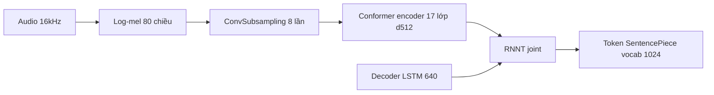
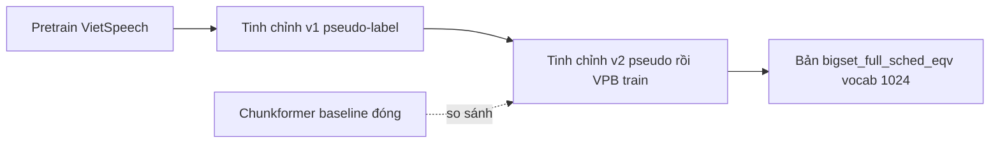

# 01 — Review domain ASR: model, dữ liệu, thí nghiệm VPB còn lại

Tài liệu kiểm kê domain ASR trong repo theo ba trục: các họ model trong NeMo, dữ liệu đã dùng, và các thí nghiệm còn sót lại từ giai đoạn làm với VPBank.
Nội dung lý thuyết và hiện trạng khách quan nằm ở Mục 1–6; đề xuất hành động tách riêng ở Mục 7.

---

## Glossary — ký hiệu viết tắt

- **WER** — Word Error Rate: tỉ lệ lỗi từ; càng thấp càng tốt.
- **CTC / RNNT / AED** — ba kiểu giải mã ASR (xem `00_overview_map.md`).
- **Encoder** — phần mạng biến log-mel thành biểu diễn ẩn; ở đây là Conformer.
- **Conformer** — kiến trúc encoder kết hợp convolution và self-attention.
- **Fast-Conformer** — biến thể Conformer hạ tần số lấy mẫu (subsampling 8×) để chạy nhanh hơn.
- **Chunkformer** — mô hình ASR đóng (không tinh chỉnh được) dùng làm baseline so sánh.
- **BPE** — tokenizer dưới từ (SentencePiece).
- **SNR** — Signal-to-Noise Ratio: tỉ số tín hiệu trên nhiễu; dùng để lọc chất lượng audio.
- **Pseudo-label** — nhãn do chính mô hình sinh ra, dùng để tinh chỉnh tiếp.
- **Manifest** — file `.jsonl`, mỗi dòng một mẫu audio + nhãn, định dạng dữ liệu chuẩn của NeMo.
- **VietSpeech** — corpus tiếng Việt công khai dùng để tiền huấn luyện (pretrain).
- **left / right channel** — hai kênh ghi âm cuộc gọi (một bên agent, một bên khách hàng).

---

## 1. Phạm vi tài liệu

- **Nguồn dữ liệu kiểm kê** — `nemo/collections/asr/` (kiến thức NeMo), `vpb_mod/` (mã và tài liệu VPB), các file report ở thư mục gốc repo.
- **Mục tiêu** — trả lời ba câu hỏi: có những model gì, dùng dữ liệu gì, còn lại thí nghiệm gì.
- **Lưu ý về đường dẫn** — các đường dẫn dữ liệu trong tài liệu VPB (`/home/ubuntu/...`, `/home/kylh/...`) trỏ tới máy huấn luyện cũ; dữ liệu thật không nằm trong repo, chỉ còn mã nguồn, tài liệu và file report.

---

## 2. Các họ model ASR trong NeMo

Phân loại theo file trong `nemo/collections/asr/models/`.

| Họ model | Class chính | Kiểu giải mã | Ghi chú |
| --- | --- | --- | --- |
| **CTC** | `EncDecCTCModel`, `EncDecCTCModelBPE` | CTC | Đơn giản, nhanh; không mô hình hóa phụ thuộc giữa token |
| **RNNT (Transducer)** | `EncDecRNNTModel`, `EncDecRNNTBPEModel` | RNNT | Phù hợp streaming; **model VPB dùng họ này** |
| **Hybrid RNNT-CTC** | `EncDecHybridRNNTCTCBPEModel` | RNNT + CTC | Một encoder, hai đầu giải mã |
| **AED multitask** | `EncDecMultiTaskModel` | AED (encoder–decoder) | Kiến trúc kiểu Canary, đa nhiệm |
| **SSL** | `SpeechEncDecSelfSupervisedModel` | — | Tiền huấn luyện tự giám sát (wav2vec-style) |
| **Classification** | `EncDecClassificationModel`, `EncDecSpeakerLabelModel` | — | Keyword spotting, phân loại, nhận dạng người nói |
| **Diarization** | `SortformerEncLabelModel`, `EncDecDiarLabelModel` | — | Phân định ai nói khi nào |

- **Encoder dùng chung** — phần lớn các họ trên cắm encoder Conformer (`asr/modules/conformer_encoder.py`); khác biệt nằm ở đầu giải mã và hàm mất mát.

---

## 3. Model VPB đã dùng — Fast-Conformer RNNT BPE

- **Class** — `EncDecRNNTBPEModel` (Fast-Conformer encoder + RNNT decoder + SentencePiece BPE).
- **Config gốc** — `tutorials/asr/configs/fast-conformer_transducer_bpe.yaml`.
- **Ba preset kích thước** (định nghĩa trong `vpb_mod/model/_1_fastformer_trans_bpe.py`):

| Preset | d_model | heads | layers | pred/joint |
| --- | --- | --- | --- | --- |
| small | 176 | 4 | 16 | 320 |
| medium | 256 | 4 | 16 | 640 |
| large | 512 | 8 | 17 | 640 |

- **Cấu hình model cuối** (đọc từ log export `vpb_mod/export_direct/asr_model.md`):
  - Encoder Conformer **d_model=512, 17 layer** (preset large).
  - Subsampling **ConvSubsampling** 8× (ba lớp Conv2d stride 2), đầu vào log-mel 80 chiều.
  - Self-attention dạng **RelPositionMultiHeadAttention** (attention có mã hóa vị trí tương đối).
  - Convolution trong block dùng **CausalConv1D** kernel 9 (hỗ trợ chế độ streaming).
  - Decoder RNNT: **LSTM 1 lớp, hidden 640**; tokenizer SentencePiece **vocab 1024**, `blank_id=1024`.

---

## 4. Dữ liệu

### 4.1 Định dạng manifest NeMo

- **Schema chuẩn** — mỗi dòng `.jsonl` có `audio_filepath`, `duration`, `text` (tùy chọn `sample_rate`).
- **Schema thô của VPB** (trước khi chuyển đổi) — `utt_id`, `audio_path`, `text`, `base_text`, và sau xử lý thêm `snr`, `snr_bucket`.
- **Mã chuyển đổi** — `vpb_mod/dataset/_2_vpb_to_nemo_manifest.py`, `_8_vpb_label_manifest.py`, `merge_manifests.py`.

### 4.2 Dữ liệu công khai tiếng Việt (`vi_small`)

Dùng cho huấn luyện từ đầu và pretrain. Số liệu từ `vpb_mod/dataset/_0_small_datasets_verify.py`.

| Dataset | Số mẫu (train / dev / test) |
| --- | --- |
| vlsp2020 | 56.427 train |
| lsvsc | 45.458 / 5.682 / 5.683 |
| fpt_fosd | 25.917 train |
| infore | 14.935 train |
| vivos | 11.660 / — / 760 |
| vietmed | 2.773 / 2.912 / 3.437 |
| vais1000 | 1.000 train |
| speech_massive | 115 / 2.033 / 2.974 |

### 4.3 Dữ liệu riêng VPB (`clean_dataset_vpb`)

- **Bản chất** — ghi âm cuộc gọi callbot/tổng đài, tách hai kênh `left` (agent) và `right` (khách hàng).
- **Tập đánh giá** — `standard_test`, `standard_test_2`, `next_day_test_debug`, `manifest_vpb_right_2` (train/valid).
- **Tập huấn luyện lớn** (`splits_by_clid_tripack`, từ `summary.tsv`):

| Nhóm | Số mẫu | Thời lượng |
| --- | --- | --- |
| all (train/val/test) | 104.567 | 55:10:56 |
| left_only | 58.792 | 37:31:17 |
| right_only | 45.775 | 17:39:38 |
| Tổng cộng | 209.134 | 110:21:51 |

### 4.4 Pipeline chuẩn bị dữ liệu

- **Khử nhiễu** — DeepFilterNet3, inference-only (`vpb_mod/preprocess/dfn_quickwin/`); phù hợp audio điện thoại nhiễu nền.
- **Đo và lọc SNR** — `vpb_mod/labeling/_1_vpb_snr.py` tính SNR theo VAD, `_2_filter_snr.py` giữ lại phần trăm cao nhất (percentile 60).
- **Phân cụm nhiễu** — `_3_fcm_label.py` (fuzzy c-means) gán nhãn chất lượng.
- **Pseudo-label** — sinh nhãn bằng chính model `.nemo` rồi gắn vào manifest (`add_model_text_to_manifests.py`).

---

## 5. Các thí nghiệm VPB còn lại trong repo

### 5.1 Huấn luyện

- **Huấn luyện từ đầu trên dữ liệu công khai** — chạy trên `lsvsc` đơn lẻ và trên tập gộp (`merged`), Fast-Conformer RNNT BPE, 100 epoch, vocab 256–512.
- **Mã** — `vpb_mod/model/_1_fastformer_trans_bpe.py` (huấn luyện), `_1_1_infer...`, `_2_fastformer_infer.py` (đánh giá).

### 5.2 Chuỗi tinh chỉnh và kết quả WER

Hướng đi: pretrain trên VietSpeech, rồi tinh chỉnh hai bước, lấy Chunkformer (model đóng đang dùng) làm baseline.

WER theo từng tập (nguồn `vpb_mod/model/doc_report_standard.md`):

| Tập đánh giá | Chunkformer | Pretrain | v1 (pseudo) | v2 (pseudo→VPB) | Ghi chú |
| --- | --- | --- | --- | --- | --- |
| standard_test_2 | 0,2499 | 0,3546 | 0,3040 | **0,2420** | Trùng ~70% với tập train |
| standard_test (29 mẫu) | 0,1613 | 0,3378 | **0,2582** | 0,4294 | Quá nhỏ, kết quả dao động |
| next_day_test_debug | 0,2076 | 0,3414 | 0,2687 | **0,2649** | Tập độc lập, đáng tin nhất |
| vpb_right2_train | 0,2420 | 0,3633 | 0,2956 | **0,2456** | Là tập train |
| vpb_right2_valid | 0,2696 | 0,3902 | 0,3240 | **0,2821** | Tập validation |

### 5.3 Phát hiện về chất lượng dữ liệu

- **Rò rỉ dữ liệu (data leakage)** — `standard_test_2` trùng ~70% với tập train (`overlap_with_anchor.summary.tsv`: overlap 2096/2993 = 0,70). WER thấp trên tập này là lạc quan, không phản ánh năng lực thật.
- **Tập đánh giá đáng tin** — `next_day_test_debug` và `vpb_right2_valid` không trùng tập train (overlap = 0), nên dùng làm thước đo chính.
- **Tập `standard_test`** — chỉ 29 mẫu, không đủ để kết luận.

### 5.4 Export ONNX và phục vụ suy luận

- **Hai nhánh export** — `vpb_mod/export/` và `vpb_mod/export_direct/` (hai lần thử khác nhau).
- **Cách làm** — tách RNNT thành ba phần encoder / decoder / joint, dò I/O từng phần (`probe_*_io.py`, `TO_KNOW.md` ghi rõ shape và dtype), dựng runtime ONNX (`nemo_like_runtime/`).
- **Phục vụ** — Triton Inference Server, Python backend `rnnt_greedy` (`vpb_mod/onnx/server/`).
- **Trạng thái chưa hoàn thiện** — WER của bản ONNX cao hơn hẳn bản `.nemo`:
  - `onnx_eval_logs/standard_test_wer.txt` = 1,03; `standard_test_2_wer.txt` = 0,57.
  - So với bản `.nemo` (~0,24–0,34), chênh lệch lớn cho thấy pipeline export/giải mã greedy trên ONNX còn lỗi, chưa khớp kết quả gốc.
  - Các vấn đề tồn đọng ghi tại `vpb_mod/export/issue.md`, `vpb_mod/onnx/issue.md` (gồm cả lỗi build Docker `youtokentome`).

---

## 6. Nhận định khách quan

- **Pros**:
  - Pipeline đầy đủ từ chuẩn bị dữ liệu, huấn luyện, đánh giá đến export, có tài liệu và log số liệu thật.
  - Quy trình tinh chỉnh hai bước (pseudo-label rồi dữ liệu thật) giảm WER rõ rệt so với pretrain.
- **Cons / hạn chế**:
  - Fast-Conformer tự huấn luyện chưa vượt được Chunkformer đóng; chỉ tiệm cận ở tập độc lập (`next_day` 0,2649 so với 0,2076).
  - Có rò rỉ dữ liệu ở `standard_test_2`, dễ dẫn tới đánh giá lạc quan nếu không lưu ý.
  - Export ONNX chưa đạt: WER bản ONNX còn lệch xa bản gốc, là phần dang dở rõ nhất.
- **Bài toán callbot đặc thù** — audio điện thoại 8–16kHz nhiễu nền, giọng địa phương, từ vựng ngoài miền (tên riêng, số tiền); các issue trong `vpb_mod/TODO.md` (mở rộng vocab, phân loại nghe-rõ/không, kết hợp nhiều trọng số) phản ánh đúng các khó khăn này.

---

## 7. Đề xuất bước tiếp (kế hoạch, tách khỏi nội dung kiểm kê)

- **Nếu tiếp tục hướng ASR**:
  - Ưu tiên đọc-hiểu lại nhánh export ONNX RNNT, vì đây là phần dang dở và có giá trị engineering cao.
  - Khi báo cáo WER, luôn dùng `next_day_test_debug` và `vpb_right2_valid` làm thước đo chính, loại `standard_test_2` khỏi kết luận do rò rỉ.
- **Phục vụ lộ trình ôn tập** — tài liệu con tiếp theo `02_ctc_rnnt_aed_decode.md` đào sâu cơ chế ba kiểu giải mã, trong đó RNNT chính là kiểu model VPB đã dùng.
- **Điểm cần làm rõ** — xác nhận với người dùng: trọng tâm tài liệu sau là cơ chế giải mã (lý thuyết) hay tái hiện/sửa pipeline export ONNX (thực hành).

---

## ✅ Tự kiểm nhanh

1. Model VPB đã dùng thuộc họ nào, class gì, kích thước ra sao?

Đáp án

Họ RNNT (Transducer), class `EncDecRNNTBPEModel`, encoder Fast-Conformer preset large (d_model=512, 17 layer), decoder LSTM 1 lớp hidden 640, tokenizer SentencePiece vocab 1024.

2. Vì sao không nên dùng WER của `standard_test_2` để kết luận năng lực model?

Đáp án

Vì tập này trùng ~70% với tập train (data leakage), nên WER thấp là lạc quan. Tập đáng tin là `next_day_test_debug` và `vpb_right2_valid` (overlap = 0).

3. Quy trình tinh chỉnh hai bước gồm những gì và hiệu quả ra sao?

Đáp án

Bước 1 tinh chỉnh bằng pseudo-label (v1), bước 2 tinh chỉnh tiếp bằng dữ liệu train VPB (v2). WER giảm dần từ pretrain (~0,35–0,39) xuống v2 (~0,24–0,28), tiệm cận Chunkformer trên tập độc lập.

4. Phần thí nghiệm nào đang dang dở và biểu hiện ra sao?

Đáp án

Export ONNX (RNNT tách encoder/decoder/joint + phục vụ Triton). WER bản ONNX (0,57–1,03) lệch xa bản `.nemo` (~0,24–0,34), cho thấy pipeline export/giải mã greedy còn lỗi.

5. Dữ liệu riêng VPB có đặc điểm gì về cấu trúc và quy mô?

Đáp án

Ghi âm cuộc gọi tách hai kênh left (agent) / right (khách hàng), tổng khoảng 110 giờ sau khi làm sạch (`splits_by_clid_tripack`), kèm các tập đánh giá riêng và nhãn SNR.

