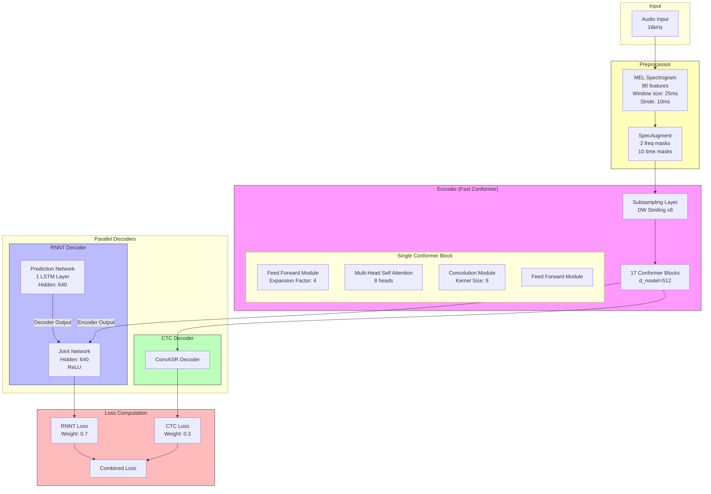

```mermaid
flowchart TB
    subgraph Input
        Audio[Audio Input
	        16kHz]
    end

    subgraph Preprocessor
        MEL[MEL Spectrogram
	    80 features
	    Window size: 25ms
	    Stride: 10ms]
        SpecAug[SpecAugment
        2 freq masks
        10 time masks]
    end

    subgraph Encoder["Encoder (Fast Conformer)"]
        direction TB
        Sub[Subsampling Layer
	DW Striding x8]
        ConformerBlocks[17 Conformer Blocks
	d_model=512]
        subgraph ConformerBlock["Single Conformer Block"]
            direction TB
            FF1[Feed Forward Module
	Expansion Factor: 4]
            MHSA[Multi-Head Self Attention
	8 heads]
            Conv[Convolution Module
	Kernel Size: 9]
            FF2[Feed Forward Module]
        end
    end

    subgraph Decoders["Parallel Decoders"]
        direction LR
        subgraph RNNTDecoder["RNNT Decoder"]
            direction TB
            PredNet[Prediction Network
	1 LSTM Layer
	Hidden: 640]
            Joint[Joint Network
	Hidden: 640
	ReLU]
        end
        
        subgraph CTCDecoder["CTC Decoder"]
            direction TB
            ConvDec[ConvASR Decoder]
        end
    end

    subgraph Loss["Loss Computation"]
        direction TB
        RNNL[RNNT Loss
	Weight: 0.7]
        CTCL[CTC Loss
	Weight: 0.3]
        Combined[Combined Loss]
    end

    Audio --> MEL
    MEL --> SpecAug
    SpecAug --> Sub
    Sub --> ConformerBlocks
    ConformerBlocks --> |Encoder Output| Joint
    ConformerBlocks --> ConvDec
    PredNet --> |Decoder Output| Joint
    Joint --> RNNL
    ConvDec --> CTCL
    RNNL --> Combined
    CTCL --> Combined

    style Encoder fill:#f9f,stroke:#333
    style RNNTDecoder fill:#bbf,stroke:#333
    style CTCDecoder fill:#bfb,stroke:#333
    style Loss fill:#fbb,stroke:#333
    style Preprocessor fill:#ffb,stroke:#333
```